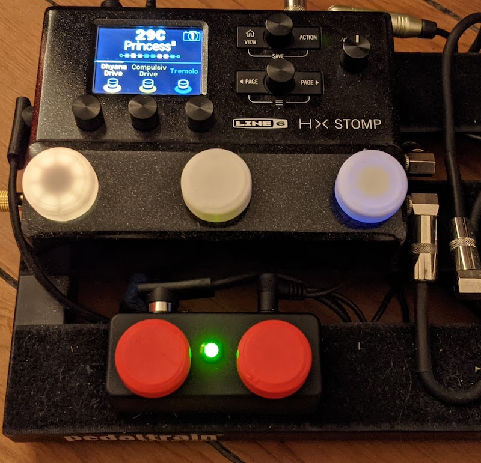

# MIDI Muppet HX

This is a small Arduino based two button MIDI foot switch for the Helix HX Stomp. It is more flexible and more powerful than the "normal" foot switches connected via TRS cable and as a bonus you can still use an expression pedal hooked up to your HX Stomp.

The MIDI Muppet HX can
- scroll up/down through presets (scroll mode)
- act as FS4/FS5 (footswitch/fs  mode)
- quickly access snapshot mode and scroll up/down through snapshots
- bring up the tuner via long press left (dn) button
- act as a two button LOOPER controller

## MIDI Muppet Main Modes

The unit supports three basic modes of operation. The LED will indicate the current mode:

| Mode | LED on boot | LED in operation |
|------|-----|-----------------|
| Scroll preset | flash red | scroll preset: red, snapshot: green, tuner: flash green |
| Footswitch FS4/FS5 | flash green | green, tuner: flash green |
| Looper  | flash red/green | play: green, record: red, overdub: yellow |

To select a mode, **press and hold both buttons** until one of the above LED patterns shows up and the mode is selected.

Next time the unit is powered on the unit will automatically switch to the mode used last.

### Using the Modes:

    SCROLL Mode:    up/dn switches program patches
                    long press dn: toggle TUNER
                    long press up: toggle SNAPSHOT mode

    Footswitch Mode: up/dn emulate footswitch FS4/FS5
                     long press dn: toggle TUNER
                     long press up: toggle SNAPSHOT mode

    SNAPSHOT Mode:  up/dn switches snapshot
                    long press dn: toggle TUNER
                    long press up: back to last mode (FS or SCROLL)
    TUNER Mode:     up or dn back to prev Mode

LOOPER Mode (if enabled):

    LOOPER Mode:    dn toggles record/overdub
                    up toggles play/stop
                    long press up toggles undo/redo

### Disabling LOOPER Control

The LOOPER mode can be disabled. This can be handy if you want to cycle between SCROLL and FS modes more quickly or you simply don't need the LOOPER mode:

- Press **up** while powering up the MIDI Muppet to toggle LOOPER control. The device will flash **green** 5 times if LOOPER mode is **enabled** and **red** to indicate that LOOPER mode has been **disabled**.

LOOPER control configuration will be stored in EEPROM and will be loaded on restart.

### Setting the MIDI Channel
MIDI channel can be set to any value between 1 and 16. HX Stomp listens on channel 1 per default.

To change the MIDI Channel:
- Press and hold **dn** while powering up the MIDI Muppet until the device flashes 10 times red and 10 times green. After a second the device will indicate the currently set MIDI channel by slowly flashing the green LED (1 flash = channel 1, ..., 16 flashes = channel 16).
- Press **up** to increase the MIDI channel or press **dn** to decrease the channel.
- Press and hold **up** and **dn** to exit MIDI channel configuration.

MIDI Channel configuration will be stored in EEPROM and will be loaded on restart.

## Building MIDI Muppet HX
Parts are around 20€:
- Stomp case: e.g. Hammond 1590A
- 2 momentary foot switches
- Arduino Pro Mini with programming headers populated
- MIDI/DIN Socket
- 2,1 mm power Socket
- bicolor LED (red/green, common cathode)
- 4 x 220R resistors (5V version of Arduino)
- Or 2 x 220R, 1 x 10R, 1 x 33R (3.3V version of Arduino)
- FTDI serial adaptor (for programming)

Make sure you know whether you have the 3.3V or the 5V version of the Arduino Pro Mini. How to find out? Apply 9V to the RAW pin and measure the VCC pin.

Luckily MIDI works with 3.3V, so if you are using the 3.3V version you have to change the resistors for the MIDI TX line (pin 5 of MIDI plug) to 10 ohms and for the MIDI voltage reference line (pin 4 of MIDI plug) to 33 ohms.

A little bit of drilling, soldering and hot snot will be required.

### Wiring
- Arduino D2, D3: Button Up/Down to ground
- Arduino D4, D5: via 220R resistor to LED green/red anode, cathode to ground
- Arduino TX pin: via 220R resistor to MIDI pin 5 (data line)
- Arduino 5V/VCC pin: via 220R resistor to MIDI pin 4 (voltage reference line)
- Arduino RAW pin: 9V from power socket
- Arduino GNC pin: GND from power socket

I put a little bit of capton tape on backside of a foot switch and on the the inside of the case for isolation and fixated the Arduino PCB with a little bit of hot snot.

### The Code
The code requires the OneButton and the JC_Button library to be installed. The Arduino library manager will be your friend.

### Programming
Disconnect external power supply first! The FTDI adaptor will provide power.

Hook up the FTDI adaptor to the Arduino board, select "Arduino Pro or Pro Mini" in your Arduino IDE, load the code, compile and upload.

The LED will flash rapidly on boot. Congratulations, you have just created a powerful controller for your HX Stomp. Have fun.

